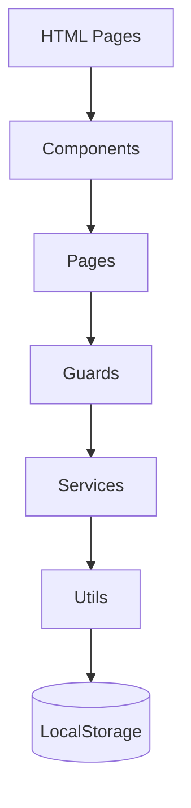
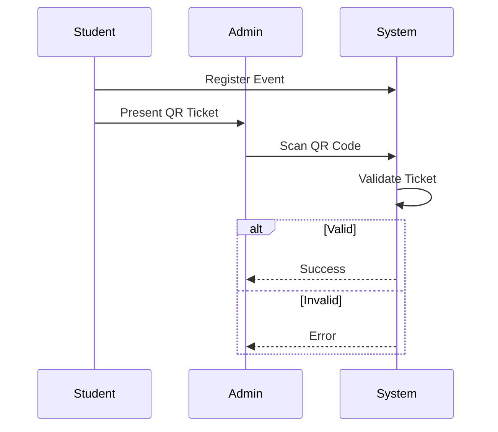

# UniDRL – University Discipline & Engagement Management System

<div align="center">


</div>

---

**UniDRL (University Discipline & Engagement Management System)** is a frontend-only web application developed as an **academic prototype** to digitally manage student event participation, attendance tracking, and discipline point evaluation (*Điểm Rèn Luyện*).

The system replaces traditional paper-based workflows with a modern **QR-code–driven process**, improving transparency, efficiency, and traceability for both students and administrators.

> ⚠️ **Academic Disclaimer**
> This project is developed strictly for educational purposes. It uses **LocalStorage** as a mock persistence layer and does not include a real backend system.
> It is **not intended for production use** without additional backend, authentication, and security mechanisms.

---

## 📑 Table of Contents

* [Overview](#-overview)
* [Features](#-features)
* [Tech Stack](#-tech-stack)
* [Project Structure](#-project-structure)
* [Installation](#-installation)
* [Usage Guide](#-usage-guide)
* [Architecture & Workflows](#-architecture--workflows)
* [LocalStorage Schema](#-localstorage-schema)
* [Troubleshooting](#-troubleshooting)
* [Project Team](#-project-team)
---

## 🔭 Overview

### Background

In many universities, student activity participation and discipline point evaluation (*Điểm Rèn Luyện*) are still handled manually using paper attendance sheets and post-event data entry. These approaches are inefficient, error-prone, and lack transparency for students.

### Problem Statement

* Time-consuming manual check-in processes
* Paper waste and poor data traceability
* Limited visibility for students regarding participation history
* High risk of errors or fraudulent attendance records

### Proposed Solution

UniDRL digitizes the entire workflow using a **QR-based event management model**:

1. Digital event registration and QR ticket generation
2. Real-time QR-based check-in verification
3. QR-based checkout combined with post-event evaluation
4. Automated participation tracking and badge assignment

### Target Users

* **Students**
  Register for events, use QR tickets, and track participation history (*My Journey*).

* **Admin (Unified Role)**
  Manage events, participants, QR scanning, badge rules, and reports.

> ℹ️ *Note on role design:*
> At the current development stage, roles such as **Advisor** and **Manager** are **not separated**. All administrative responsibilities are grouped under a single **Admin** role. This design choice simplifies implementation for an academic prototype. Role-based authorization is planned for future expansion.

---

## ✨ Features

### 🎓 Student Portal

* User authentication (Login / Signup)
* Browse and search available events
* One-click event registration
* Automatic QR ticket generation (`StudentID_EventID`)
* QR-based event check-in
* QR-based event checkout
* Post-event Q&A evaluation
* Badge system (Bronze / Silver / Gold)
* Participation history tracking (*My Journey*)
* Personal profile management

### 🛡️ Admin Dashboard

* Create, update, and close events
* Participant list management
* QR-based check-in via camera scanner
* Time-limited checkout QR generation
* Badge rule and Q&A configuration
* Attendance statistics and report export

---

## 🛠 Tech Stack

| Category     | Technologies                          |
| ------------ | ------------------------------------- |
| Core         | HTML5, CSS3, JavaScript (ES6 Modules) |
| Styling      | Tailwind CSS (Utility-first)          |
| Architecture | Component-based, Service-oriented     |
| Persistence  | LocalStorage (Mock Database)          |
| Libraries    | `html5-qrcode`, Google Fonts          |
| Tools        | VS Code, Live Server, Git             |

---

## 📂 Project Structure

```bash
UniDRL/
├── admin/                  # Admin-facing pages
│   ├── badge-management.html
│   ├── check-in-management.html
│   ├── participants-management.html
│   └── report.html
├── components/             # Reusable UI components
├── config/                 # Application constants
├── data/                   # Mock data sources
├── guards/                 # Authentication guards
├── libs/                   # Third-party library adapters
├── managers/               # Feature-specific managers
├── pages/                  # Page-level controllers
├── services/               # Business logic services
├── student/                # Student-facing pages
│   ├── my-event.html
│   ├── my-journey.html
│   └── profile.html
├── utils/                  # Helper utilities
├── index.html              # Landing page
├── login.html              # Login page
├── signup.html             # Signup page
├── home.html               # Main dashboard
└── event-detail.html       # Event detail page
```

---

## ⚡ Installation

### Prerequisites

* Modern browser (Chrome, Edge, Firefox)
* Visual Studio Code
* Live Server extension (recommended)

### Steps

1. Clone the repository:

   ```bash
   git clone https://github.com/trvanluc/UniDRL.git
   cd UniDRL
   ```

2. Open the project in Visual Studio Code.

3. Right-click `index.html` → **Open with Live Server**.

4. Access the application in your browser:

   ```
   http://127.0.0.1:5500/index.html
   ```

> ⚠️ **Important:**
> Running via a local server is required due to ES6 Module restrictions. Opening HTML files directly will cause module loading errors.

---

## 🎮 Usage Guide

### 👨‍🎓 Student Workflow

1. Register and log in to the system
2. Browse available events
3. Register for an event to receive a QR ticket
4. Present the QR code for event check-in
5. Scan the Admin’s checkout QR at event end
6. Complete the post-event Q&A evaluation
7. Receive a badge and updated participation history

### 🛡️ Admin Workflow

1. Create and manage events
2. Scan student QR codes for check-in
3. Generate checkout QR codes with configurable time limits
4. View attendance statistics and export reports

---

## 🏗 Architecture & Workflows

### System Architecture



### Check-in Workflow



> ℹ️ **Note for academic submission:**
> Mermaid diagrams are optional. If not supported, they still demonstrate architectural understanding.

---

## 💾 LocalStorage Schema

| Key | Type | Description |
|-----|------|-------------|
| `UNIDRL_USERS` | `Array<User>` | Stores all registered user accounts, including students and administrators |
| `UNIDRL_EVENTS` | `Array<Event>` | Contains metadata of all events in the system |
| `UNIDRL_REGISTRATIONS` | `Array<Registration>` | Maintains the mapping between students and their registered events |
| `UNIDRL_CURRENT_USER` | `User \| null` | Holds session data of the currently authenticated user |
| `UNIDRL_BADGE_CONFIG` | `Object<EventId, BadgeConfig>` | Defines badge rules and post-event Q&A evaluation criteria per event |


---

## 🐞 Troubleshooting

### Camera not working

Ensure the application runs on `localhost` or HTTPS. Browsers block camera access on insecure origins.

### ES Module errors

Do not open HTML files directly. Always use Live Server or another local HTTP server.

### Missing styles

Check internet connection. Tailwind CSS is loaded via CDN.

---

## 👥 Project Team

**Group 3** UniDRL Development Team  
**Course:** Web Development  
**Institution:** Vietnam-UK Institute for Research and Executive Education

| No. | Full Name            | Student ID | Key Responsibilities |
|----:|----------------------|------------|----------------------|
| 1   | Nguyen Vu Hoang Long | 23090026   | System architecture & authentication: designed the overall project structure, prepared technical documentation, developed authentication services, route guards, and shared UI components (dialogs, toast notifications), Design UI and core logic. |
| 2   | Tran Van Nhan        | 23090036   | QR core & check-in module: integrated QR code scanning, implemented check-in management logic, generated checkout QR codes, rendered QR tickets, handled camera access and permissions, and implemented badge and participation journey display logic. |
| 3   | Tran Van Luc         | 23090019   | Student portal: developed the student dashboard, managed user profile features, and integrated technical requirements requested by the lecturer (Vite build optimization and Google Analytics). |
| 4   | Huynh Huu Nhu Man    | 23090020   | Admin dashboard: implemented event CRUD operations, participant management features, modal manager, and designed the overall UI styling and theme system. |


> All team members collaborated on system design, implementation, testing, and documentation of this academic prototype.


<div align="center">
  <sub>Developed for academic purposes – Web Development Course</sub>
</div>
